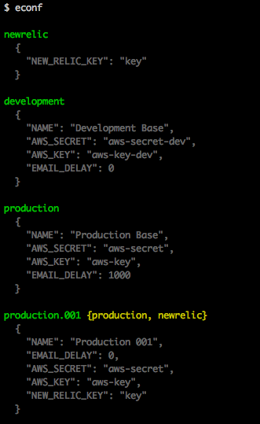
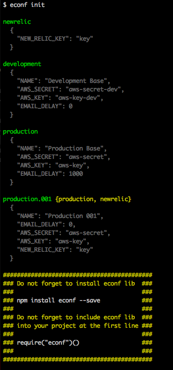

econf
=========

Load configs from hierarchical objects to process.env

[](http://badge.fury.io/js/econf)
[](https://david-dm.org/rodrigok/econf#info=dependencies)
[](https://david-dm.org/rodrigok/econf#info=devDependencies)
[](https://travis-ci.org/rodrigok/econf)

[](https://nodei.co/npm/econf/)
[](https://nodei.co/npm/econf/)


By default econf tries to load .econf.js file


#Usage
Import the econf at the top of your code to ensure that your configurations will be loaded before anything else

```javascript
require('econf')();
```

optionally, you can specify the file name

```javascript
require('econf')('config.js');
```

#.econf.js example
```javascript
module.exports = [
	{
		_name: 'newrelic',
		NEW_RELIC_KEY: 'key'
	},
	{
		_name: 'production',
		NAME: 'Production Base',
		AWS_SECRET: 'aws-secret',
		AWS_KEY: 'aws-key',
		EMAIL_DELAY: 1000
	},
	{
		_name: 'production.001',
		_extend: ['production', 'newrelic'],
		NAME: 'Production 001',
		EMAIL_DELAY: 0
	}
]
```

The config above will inject the code below into process.env
```javascript
{
	"_name": "production.001",
	"_extend": [
		"production",
		"newrelic"
	],
	"NAME": "Production 001",
	"EMAIL_DELAY": 0,
	"AWS_SECRET": "aws-secret",
	"AWS_KEY": "aws-key",
	"NEW_RELIC_KEY": "key"
}
```

#Global Usage
```javascript
npm install econf -g
```

With global version you can view your config parsed, just execute econf into your project directory
```javascript
econf
```



To create a example .econf.js file into your project just execute econf init into your project directory
```javascript
econf init
```
